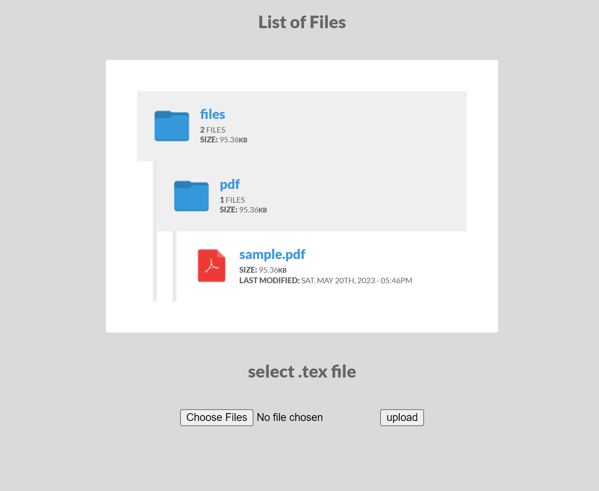

# Docker Compose Example with Nginx, PHP-FPM 7.4, and miktex

This is an example of how to run a PHP application with [Nginx](https://www.nginx.com/), [PHP-FPM 7.4](https://www.php.net/releases/7_4_0.php), and [miktex](https://miktex.org/) using [Docker Compose](https://docs.docker.com/compose/).

<!-- https://github.com/HamishFleming/tex-docker/tree/cdcc72c32ec28e95b597d3fd5b66031260a1eb8d/imgs -->
<!-- embed the image from that url -->


## Table of Contents
- [Background](#background)
- [Getting Started](#getting-started)
  - [Prerequisites](#prerequisites)
  - [Usage](#usage)
    - [Running](#running)
    - [Stopping](#stopping)
    - [Configuration](#configuration)
      - [Application Parameters](#application-parameters)
      - [PHP Parameters](#php-parameters)
      - [Nginx Parameters](#nginx-parameters)
      - [miktex Parameters](#miktex-parameters)
      - [Docker Parameters](#docker-parameters)
- [References](#references)

## Background

Composed of a simple PHP application to allow for uploading a tex file, and browsing the resulting pdf.

## Getting Started

### Prerequisites

- [Docker](https://docs.docker.com/get-docker/)
- [Docker Compose](https://docs.docker.com/compose/install/)

### Usage

To get started, make sure you have [Docker installed](https://docs.docker.com/get-docker/) on your system, and then clone this repository.

#### Running

To start the application, run the following command from within the root directory of this project:

```bash
docker-compose up -d
```

#### Stopping

To stop the application, run the following command from within the root directory of this project:

```bash
docker-compose down
```

#### Configuration

The following tables list the configurable parameters of the PHP application and their default values.

##### Application Parameters

| Parameter | Description | Default |
|-----------|-------------|---------|
| `APP_CODE_PATH_HOST` | Path on the host machine to the application code | `./app` |
| `APP_CODE_PATH_CONTAINER` | Path to the application code within the container | `/var/www/html` |
| `APP_CODE_PATH_CONTAINER` | Path to the application code within the container | `/var/www/html` |
| `APP_PORT_HOST` | Port to access the application from the host machine | `8080` |
| `APP_PORT_CONTAINER` | Port the application is running on within the container | `80` |

##### PHP Parameters

| Parameter | Description | Default |
|-----------|-------------|---------|
| `PHP_VERSION` | PHP version to use | `7.4` |
| `PHP_PORT_CONTAINER` | Port the PHP-FPM service is running on within the container | `9000` |
| `PHP_MEMORY_LIMIT` | Maximum amount of memory a script may consume | `512M` |
| `PHP_POST_MAX_SIZE` | Maximum size of POST data that PHP will accept | `100M` |
| `PHP_UPLOAD_MAX_FILESIZE` | Maximum allowed size for uploaded files | `100M` |
| `PHP_MAX_EXECUTION_TIME` | Maximum time in seconds a script is allowed to run before it is terminated by the parser | `600` |

##### Nginx Parameters

| Parameter | Description | Default |
|-----------|-------------|---------|
| `NGINX_VERSION` | Nginx version to use | `1.19` |
| `NGINX_PORT_HOST` | Port to access the Nginx service from the host machine | `8080` |
| `NGINX_PORT_CONTAINER` | Port the Nginx service is running on within the container | `80` |
| `NGINX_WORKER_PROCESSES` | Number of worker processes | `4` |
| `NGINX_WORKER_CONNECTIONS` | Number of connections per worker process | `1024` |

##### miktex Parameters

| Parameter | Description | Default |
|-----------|-------------|---------|
| `MIKTEX_VERSION` | miktex version to use | `20.10` |
| `MIKTEX_PORT_HOST` | Port to access the miktex service from the host machine | `8080` |
| `MIKTEX_PORT_CONTAINER` | Port the miktex service is running on within the container | `80` |
| `MIKTEX_WORKER_PROCESSES` | Number of worker processes | `4` |
| `MIKTEX_WORKER_CONNECTIONS` | Number of connections per worker process | `1024` |

##### Docker Parameters

| Parameter | Description | Default |
|-----------|-------------|---------|
| `DOCKER_COMPOSE_FILE` | Path to the Docker Compose file | `docker-compose.yml` |
| `DOCKER_COMPOSE_PROJECT_NAME` | Name of the Docker Compose project | `docker-nginx-php-example` |
| `DOCKERFILE_PATH` | Path to the Dockerfile | `./docker` |
| `DOCKERFILE_NAME` | Name of the Dockerfile | `Dockerfile` |
| `DOCKERFILE_PHP_NAME` | Name of the Dockerfile for PHP | `Dockerfile-php` |
| `DOCKERFILE_NGINX_NAME` | Name of the Dockerfile for Nginx | `Dockerfile-nginx` |
| `DOCKERFILE_MIKTEX_NAME` | Name of the Dockerfile for miktex | `Dockerfile-miktex` |
| `DOCKERFILE_PHP_IMAGE_NAME` | Name of the Docker image for PHP | `docker-nginx-php` |

## References

- [Docker Compose](https://docs.docker.com/compose/)
- [Docker Compose file reference](https://docs.docker.com/compose/compose-file/)
- [Dockerfile reference](https://docs.docker.com/engine/reference/builder/)
- [Nginx](https://www.nginx.com/)
- [PHP-FPM](https://www.php.net/manual/en/install.fpm.php)
- [miktex](https://miktex.org/)
- [Docker Compose Example with Nginx, PHP-FPM 7.4, and miktex](https://github.com/HamishFleming/tex-docker)
